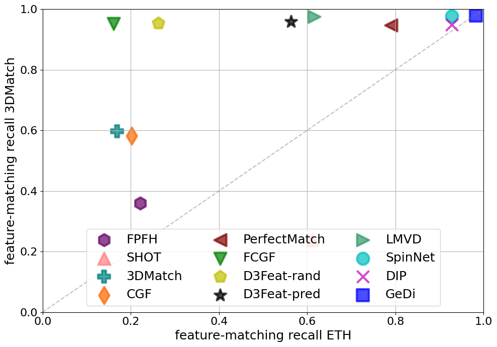
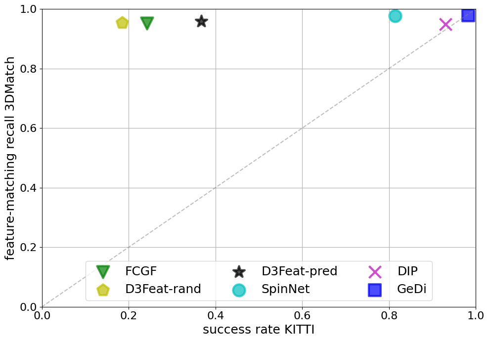
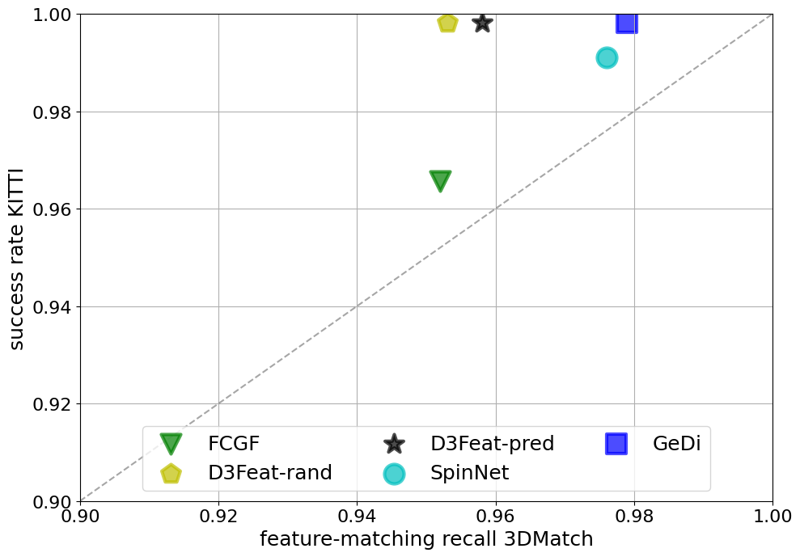

# Generalisable and Distinctive (GeDi) 3D local deep descriptors for point cloud registration

| 3DMatch ⟶ ETH        | 3DMatch ⟶ KITTI           | KITTI ⟶ 3DMatch
|:---------------------------:|:---------------------------:|:---------------------------:|
|  |  |  |

## Description

An effective 3D descriptor should be invariant to different geometric transformations, such as scale and rotation, repeatable in the case of occlusions and clutter, and generalisable in different contexts when data is captured with different sensors.
GeDi is a simple but yet effective method to learn generalisable and distinctive 3D local descriptors that can be used to register point clouds captured in different contexts with different sensors.
Point cloud patches are extracted, canonicalised with respect to their local reference frame, and encoded into scale and rotation-invariant compact descriptors by a PointNet++-based deep neural network.
Our descriptors can effectively generalise across different sensor modalities from locally and randomly sampled points.
The graphs above show the comparison between our descriptors and state-of-the-art descriptors on several indoor and outdoor datasets reconstructed using both RGBD sensors and laser scanners.
In particular, [3DMatch](https://3dmatch.cs.princeton.edu/) is an indoor dataset captured with RGBD sensors, [ETH](https://projects.asl.ethz.ch/datasets/doku.php?id=laserregistration:laserregistration) and [KITTI](http://www.cvlibs.net/datasets/kitti/eval_odometry.php) are outdoor datasets captured with laser scanners.
Our descriptors outperform most recent descriptors by a large margin in terms of generalisation, and become the state of the art also in benchmarks where training and testing are performed in same scenarios.

[Paper (pdf)](https://arxiv.org/pdf/2105.10382.pdf)

## References

- FPFH: R. Rusu, N. Blodow, and M. Beetz, *Fast point feature histograms for 3D registration,* in Proc. of IEEE ICRA, Kobe, JP, May 2009 ([pdf](https://www.cvl.iis.u-tokyo.ac.jp/class2017/2017w/papers/5.3DdataProcessing/Rusu_FPFH_ICRA2009.pdf))
- SHOT: S. Salti, F. Tombari, and L. Di Stefano, *SHOT: Unique signaturesof histograms for surface and texture description,* CVIU, vol. 125,pp. 251–264, Aug 2014 ([pdf](https://d1wqtxts1xzle7.cloudfront.net/42972440/SHOT_Unique_Signatures_of_Histograms_for20160223-22934-hz4swl.pdf?1456231597=&response-content-disposition=inline%3B+filename%3DSHOT_Unique_signatures_of_histograms_for.pdf&Expires=1621501810&Signature=AfL6vBg1NzVt7tdy3K5clW09mvcu7fgoTqH-M~z4rM0OW3RrUfw7OGgBnmUkjL5LWIbfRxp6iA9upBCpNRyOmoyPZBYmnN4TbTYc95AwXNLOFyedJJPlG2pj1Bc~psfjk~dKj8lx4auowyd94J6ITQmLLPgRaJtApItq~RwINWfP1IMjIpKGfDGCTVw-U1Sw8iAGwTgac3sRNTqVUex5QLcK6z5aagizxG4Qv9hacc2vjGJA0AHrY--NYAwF~RaPaW0BRzR9ULPxOTGGfmK-ZSbi9ZGGeLgkjWCOKlMBy2sDRQxIAHF6ZaQO8xVg4r2es9wH89bXmki4VlXdlxsrjg__&Key-Pair-Id=APKAJLOHF5GGSLRBV4ZA))
- 3DMatch: A. Zeng, S. Song, M. Niessner, M. Fisher, J. Xiao, and T. Funkhouser, *3DMatch: Learning the matching of local 3D geometry in range scans,* in Proc. of IEEE CVPR, Hawaii, US, Jul 2017 ([pdf](https://arxiv.org/pdf/1603.08182.pdf))
- CGF: M. Khoury, Q.-Y. Zhou, and V. Koltun, *Learning compact geometric features,* in Proc. of IEEE ICCV, Venice, IT, Oct 2017 ([pdf](https://arxiv.org/pdf/1709.05056.pdf))
- PerfectMatch: Z. Gojcic, C. Zhou, J. Wegner, and W. Andreas, *The perfect match: 3D point cloud matching with smoothed densities,* in Proc. of IEEE CVPR, Long Beach, US, Jun 2019 ([pdf](https://arxiv.org/pdf/1811.06879.pdf))
- FCGF: C. Choy, J. Park, and V. Koltun, *Fully Convolutional Geometric Features,* in Proc. of IEEE ICCV, Seoul, KR, Oct 2019 ([pdf](https://openaccess.thecvf.com/content_ICCV_2019/papers/Choy_Fully_Convolutional_Geometric_Features_ICCV_2019_paper.pdf))
- D3Feat: X. Bai, Z. Luo, L. Zhou, H. Fu, L. Quan, and C.-L. Tai, *D3Feat: Joint Learning of Dense Detection and Description of 3D Local Features,* in Proc. of IEEE CVPR, Virtual, Jun 2020 ([pdf](https://arxiv.org/pdf/2003.03164.pdf))
- LMVD: L. Li, S. Zhu, H. Fu, P. Tan, and C.-L. Tai, *End-to-End Learning Local Multi-view Descriptors for 3D Point Clouds,* in Proc. of IEEE CVPR, Virtual, Jun 2020 ([pdf](https://arxiv.org/pdf/2003.05855.pdf))
- SpinNet: S. Ao, Q. Hu, B. Yang, A. Markham, and Y. Guo, *SpinNet: Learning a General Surface Descriptor for 3D Point Cloud Registration,* in Proc. of IEEE CVPR, Virtual, Jun 2021 ([pdf](https://arxiv.org/pdf/2011.12149.pdf))
- DIP: F. Poiesi and D. Boscaini, *Distinctive 3D local deep descriptors,* in Proc. of IEEE ICPR, Virtual, Jan 2021 ([pdf](https://arxiv.org/pdf/2009.00258.pdf))
